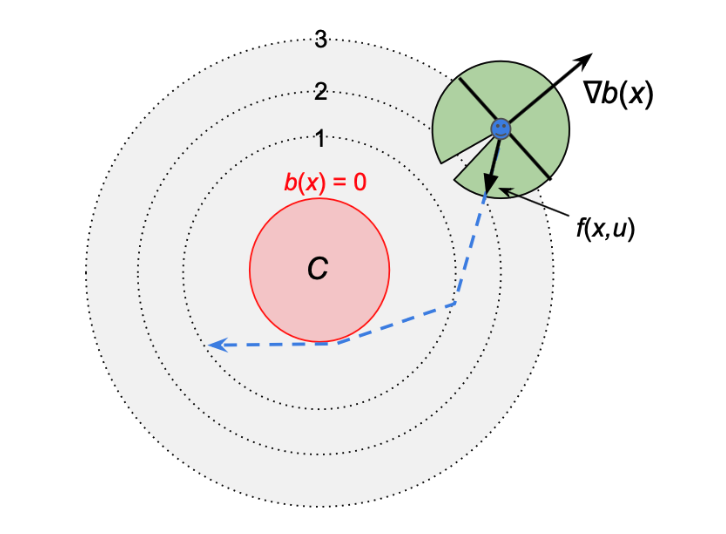
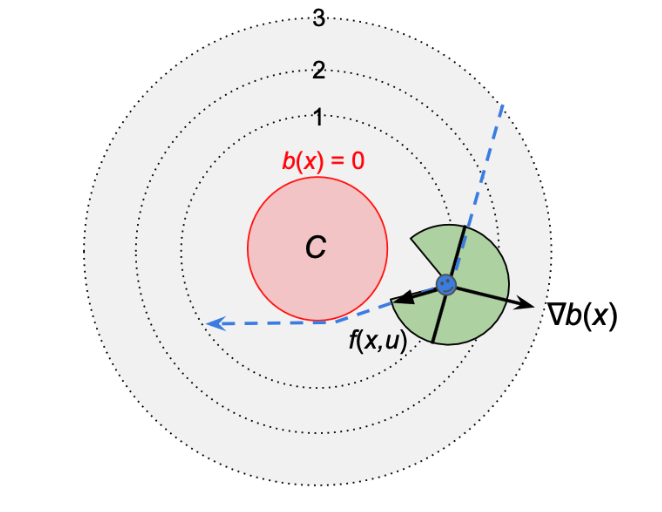
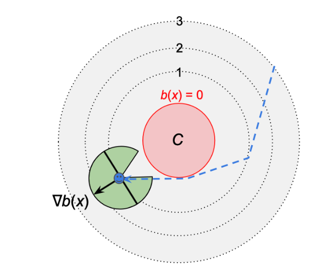

# A Quick Note of Control Barrier Function 
## Objectives
1. To provide a foundational understanding of Control Barrier Functions
2. To demonstrate the application of CBFs in real-world scenarios
## Introduction 
Control Barrier Functions (CBFs) is a critical component in the design of safety-critical control systems. As the demand for autonomous technologies and intelligent control systems continues to rise, ensuring the safety of these systems becomes paramount. CBFs play an indispensable role in this context by providing a robust mathematical framework to enforce safety constraints dynamically, keeping the system states within safe operational boundaries. In this note, we will discuss the fundamentals of CBFs from their theoretical basis to practical applications.  
## Preliminary
### Theoretical Motivation
Before talking about the definition of Control Barrier Function (CBF), it's essential to first grasp two foundational concepts that underpin the development of CBFs. The first one is the notion of a control invariance set. This concept is crucial as it pertains to the sets of states from which the control system can be maintained within desired limits through appropriate control actions. The second key concept is that of a Control Lyapunov Function (CLF), which provides a mathematical tool to assess the stability of a control system. 

#### Definition (Positively Invariant Set)
In mathematical analysis, a positively (or positive) invariant set is a set with the following properties: 
Suppose $\dot{x} = f(x)$ is a dynamical system, $x(t, x_0)$ is a trajectory, and $x_0$ is the initial point. Let $\mathbb{O} : = \{x \in \mathbb{R^n} \mid \varphi (x) =0 \}$ where $\varphi$ is a real-valued function. [1]The set $\mathbb{O}$ is said to be positively invariant if $x_0 \in \mathbb{O}$ implies that $x(t, x_0) \in \mathbb{O}$ $\forall$ t $\geq 0$.   

In other words, once a trajectory of the system enters $\mathbb{O}$, it will never leave it again.

#### Definition (Control Invariant Set)
 Fro a dynamic system $\dot{x} = f(x, u)$ where x is state of the system, u is the control input. $X$ is said to be a control invariant set if any every initial state $x_0$ in $X$, then there exists a control input $u(t)$ such that $x(t) \in X$  $\forall$ $t \geq 0$. In other words, any dynamic system enter the set, then there exists a controller that can promise the system states stay in the set forever when time greater than zero. 
#### Definition (Control Lyapunov Function)
Consider an autonomous dynamical system with inputs $\dot{x} = f(x, u)$ where x $\in \mathbb{R^n}$ is the state vector and  $u \in \mathbb{R^m}$ is the control vector. Suppose our goal is to drive the system to an equilibrium $x_* \in \mathbb{R^n}$ from every initial state in some domain. [2]  
A control-Lyapunov function (CLF) is a function $V$ : $D \longrightarrow \mathbb{R}$ that is continuously differentiable, positive-definite, and such that for all $x \in \mathbb{R^n} (x \neq 0)$ , there exist u $\in \mathbb{R^m}$ such that   

$$
\dot{V}(x,u)  = \nabla V(X)^T f(x, u) = L_f V(x) + L_g V(x) u< 0
$$

where, $L_f V(x)$ is called lie derivative of $V(x)$ along f(x).   

And a theorem follows: For the nonlinear control system if there exists a control Lyapunov function, then any continuous feedback controller $u(x)$ asymptotically stabilizes the system to $x_*$. 

## Control Barrier Function 
Suppose that we have an affine control system: 

$$
\dot{x} = f(x) + g(x) u 
$$   

with $f$ and $g$ locally Lipschitz, $x \in D \subset \mathbb {R^n}$ and $u \in U \subset \mathbb {R^m}$ is the set of admissible control inputs.   
Unlike Control Lyapunov Function that promises a **stability** which involves driving a system to a point (or a set) by dissapating energy of the trajectory. **Safety** can be framed in the context of enforcing invariance of a set, i.e., not leaving a safe set once entering the zone. In particular, we consider a set ${Q}$ defined as the superlevel set of a continuously differentiable function $b: {D} \subset \mathbb{R^n} \longrightarrow \mathbb{R}$, yielding: [3]

$$
\begin{align}
Q = \{ x \in D \subset \mathbb {R^n} : b(x) \geq 0 \}, 
\\
\partial Q = \{x \in D \subset \mathbb {R^n} : b(x) = 0 \}, 
\\
\text{Int}(Q) = \{x \in D \subset \mathbb {R^n} : b(x) > 0 \}. 
\end{align}
$$  

We refer to ${Q}$ as the safe set.   

While inspired by and expanding upon Control Lyapunov Functions (CLFs), Control Barrier Functions (CBFs) differ by aiming to enforce set invariance without the strict requirement of a positive definite function. The continuously differentiable function defined for CBFs ensures the invariance of our designated safe set, but not its sublevel sets.
This motivates the formulation of control barrier functions. Before defining these, we note that an extended class ${K_\infty}$ function is a function $\alpha : \mathbb{R} \longrightarrow \mathbb{R}$ that is strictly increasing and with $\alpha(0) =0$. Extended functions are defined on entire real line: $\mathbb R = (-\infty, \infty)$. Then, we can define the Control Barrier Functions now.   

### Definition (Control Barrier Function)

Let $Q \subset D \subset \mathbb {R^n}$ be the superlevel set of a continuously differentiable function $b : D \longrightarrow \mathbb {R}$, then $b$ is a Control Barrier Function (CBF) if there exists an extended class $K_{\infty}$ function $\alpha$ such that for the control affine system: [3]

$$
\text{sup}_{u\in U} [L_f b(x) + L_g b(x) u] \geq - \alpha (b(x)) $$ 

for all $x \in D$  
Hence, we can quantify the set of all control inputs at a point $x \in D$ that can guarantee the system's safety via CBFs. 

$$
K_{cbf}(x) = \{u \in U : L_f b(x) + L_g b(x) u + \alpha (b(x)) \geq 0 \}
$$  

Common choice of $\alpha$ is to be $:\alpha(r) = \alpha_0(r)$

To better understand the Control Barrier Function, we examine the following cases for the system as it moving to the undesirable set ${C}$. ${C}$ is unsafe region where $C = \{x \in D \mid b(x) \leq 0 \}$ and assume $\alpha_0 =1$. 

1. The system is relatively far from the undesired set so it can to move in any direction basically. Notice not all directions are allowed such as going directly toward C. 

$$
L_f b(x) + L_g b(x) u   \geq - 3
$$

2. As the system approaches the undesired set ${C}$, the range of available directions to take is reduced. 

$$ 
L_f b(x) + L_g b(x) u   > - 1 
$$

3. When the system is on the boundary of the undesired set, the only possible set of actions are to move along the boundary of ${C}$ or to move away in any direction.

$$ 
L_f b(x) + L_g b(x) u   \geq 0 
$$

4. When the system moves away from the undesired set, the possible range of actions in increased. 

$$
L_f b(x) + L_g b(x) u   \geq -1 
$$

## Optimization Based Control 
We already established that Control Barrier Functions promise a necessary and sufficient conditions on safety. More important is that we wish to do so in a minimally invasive fashion, like modifying an existing controller in a minimal way so as to guarantee safety. This naturally leads to optimization based controllers:   
Suppose we have a feedback controller $u = k(x)$ for the control system, and to modify this controller in a minimal way so as to guarentee safety, we can consider the following Quadratic Program (QP) based controller that finds the minimum perturbation on $u$: [3]

$$
\begin{align}
u(x) = \text{argmin}_{u \in {R^m}} \hspace{0.3cm} \frac{1}{2} || u - k(x) ||_2^2 \\
\\
\hspace{0.5cm} \text{s.t.} \hspace{0.3cm} L_f b(x) + L_g b(x)
u \geq \alpha (b(x)) 
\end{align}
$$  

This approach combines control barrier functions (CBFs) with quadratic programming (QP) to compute control inputs that guarantee the invariance of a safe set defined by the CBFs. In practical applications, the QP-based controller acts as a safety filter over the nominal controller. It adjusts the control inputs to ensure they comply with the system's safety requirements. By doing so, it guarantees that the system remains within safe operational boundaries at all times. This setup is useful in dynamic environments that safety is extremely important, such as in autonomous vehicles and robotic systems. 

## Conclusion 
To summarize, this note touched on the foundational aspects of Control Lyapunov Functions (CLFs) and the concept of invariant sets, which are crucial for the discussion of Control Barrier Functions (CBFs). Then, we has discussed the fundamental mathematical principles of Control Barrier Functions (CBFs) and their practical application through CBF-based controllers in various real-life scenarios. These two are important in maintaining system stability and safety. Finally, we talked about CBF-QP controllers that can effectively act as safety filters, adjusting control inputs to ensure control system stay within safe boundaries. This capability is especially vital in dynamic fields. 

## References 
1. Wikipedia, "Positively Invariant Set", https://en.wikipedia.org/wiki/Positively_invariant_set
2. Wikipedia,"Control Lyapunov Function", https://en.wikipedia.org/wiki/Control-Lyapunov_function
3. A. Ames, S. Coogan, M. Egerstedt, G. Notomista, K. Sreenath, P. Tabuada. "Control Barrier Functions: Theory and Applications," 2019.
4. Karen Leung, "Last Year's Scribe Notes", 2023
5. Wei Xiao, Calin Belta. "High-Order Control Barrier Functions", 2022. 
