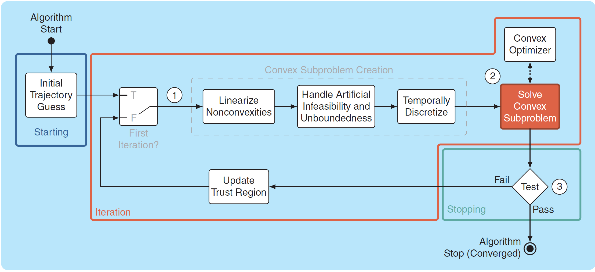
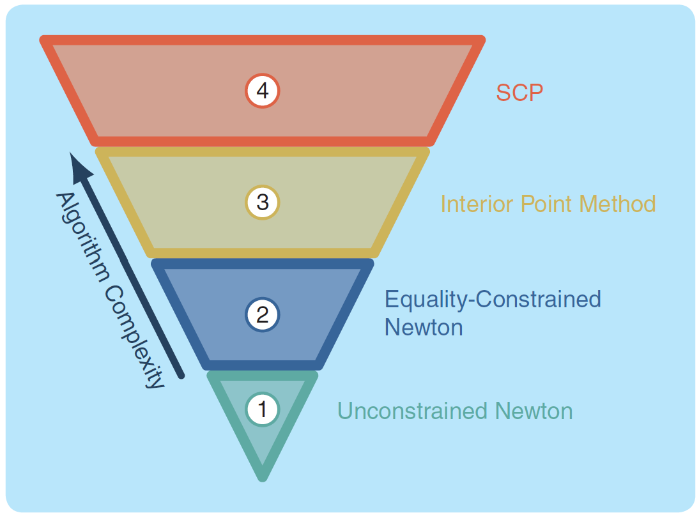

# Successive Convexification (SCvx) and Guaranteed Sequential Trajectory Optimization (GuSTO) SCP Algorithms

## SCOPE
This note is all about two specific **Sequential Convex Programming (SCP)** algorithms; **Successive Convexification (SCvx)** and **Guaranteed Sequential Trajectory Optimization (GuSTO)**. We will briefly introduce SCP before diving into the two algorithms discussing what 
they are used for and how to use them. This is a collection of notes taken from a paper written by researchers from the University of 
Washington's Autonomous Controls Laboratory (UW ACL), the developers of the two algorithms[1].

## Motivation and Introduction
Generating safe and reliable trajectories is crucial in the autonomous world through the computation of multidimensional discrete state and control signals within a set of constraints that satisfies a set of specifications while optimizing for a mission objective. This challenges engineers and researchers to develop algorithms that focus on the safety, performance, and trustworthiness of trajectory generation. Numerical Optimization presents a great solution for the generation and optimization of trajectories to meet objectives so it can be expressed as an Optimal Control Problem.

The optimization problem is solved through the following:
> 1. **Formulation:** specifications of how the functions to be minimized and constraints to be satisfied are expressed mathematically.
> 2. **Discretization:** approximation of the infinite-dimensional state and control signals by a finite-dimensional set of basis functions.
> 3. **Numerical Optimization:** iterative computation of an optimal solution of the discretized problem.

In terms of efficiency and reliability for numerical optimization, discretized convex problems are the way to go, which is the main motivation for **Convex Programming** or **Convex Optimization**. However, you may find that most problems in the real world are **nonlinear (nonconvex)**, which leads to the topic of **Convexification** and **SCP** for trajectory generation of nonlinear dynamic systems based on convex optimization. The main idea of SCP is iterative convex approximation as the name suggests. The general outline of an SCP algorithm is shown in **Fig. 1** where it starts with an initial trajectory guess that goes through an iteration scheme that optimizes the trajectory until it converges into a feasible solution at which the iteration is stopped. With SCP, safe and reliable trajectories can be generated for nonconvex functions.

**Figure 1:** Block diagram of a typical SCP algorithm acquired from [1].

An algorithm hierarchy in **Fig. 2** shows where SCP lies. Typically, the convex solver in layer 2 of **Fig. 1** iteratively calls an **Interior Point Method (IPM)** algorithm from layer 3 in **Fig. 2** that solves a convex problem with linear equality and convex inequality constraints as a sequence of linear equality-constrained problems and thus, IPM iteratively calls the algorithm in layer 2 in **Fig. 2**.

**Figure 2:** Algorithm hierarchy also acquired from [1].

## Preliminaries
**Formulation**
The objective of SCP is to solve continuous-time-optimal control problems in the following form:
|Equation  |#      |
|----------|-------|
|$$\min_{u, p} J(x, u, p),$$| (1a)|
|$$s.t. \quad \dot{x}(t) = f(t, x(t), u(t), p),$$| (1b)|
|$$(x(t), p) \in \mathcal{X}(t),$$| (1c)|
|$$(u(t), p) \in \mathcal{U}(t),$$| (1d)|
|$$s(t, x(t), u(t), p) \leq 0,$$| (1e)|
|$$g_{ic}(x(0), p) = 0,$$| (1f)|
|$$g_{tc}(x(1), p) = 0,$$| (1g)|
where $x(.) \in \mathbb{R}^{n}$ is the state trajectory, $u(.) \in \mathbb{R}^{m}$ is the control trajectory, and $p \in  \mathbb{R}^{d}$ is a vector of parameters. The function $f:\mathbb{R} \times \mathbb{R}^{n} \times \mathbb{R}^{m} \times \mathbb{R}^{d} \rightarrow \mathbb{R}^{n}$ represents the nonlinear dynamics assumed to be at least once continuously differentiable. Continuously differentiable functions $g_{ic}: \mathbb{R}^{n} \times \mathbb{R}^{d} \rightarrow \mathbb{R}^{n_{ic}}$ and $g_{tc}: \mathbb{R}^{n} \times \mathbb{R}^{d} \rightarrow \mathbb{R}^{n_{tc}}$ enforces the initial and terminal boundary conditions. The sets $\mathcal{X}(t)$ and $\mathcal{U}(t)$ represent the convex path constraints of state and control. The continuously differentiable function $s:\mathbb{R} \times \mathbb{R}^{n} \times \mathbb{R}^{m} \times \mathbb{R}^{d} \rightarrow \mathbb{R}^{n_{s}}$ represents the nonconvex path constraints. $\mathcal{X}(t)$ and $\mathcal{U}(t)$ are assumed to be compact, that is, closed and bounded so that the system cannot escape to infinity or apply impossible control inputs. Equation (1) is defined on the [0,1] time interval and the constraints must hold at each time instant where the initial and final time parameters in $p$, $t_{0}$ and $t_{f}$, can be substituted. 

The cost function (1a) is assumed to be in the form:
|Equation | #|
|-----|----|
|$$J(x, u, p) = \phi(x(1), p) + \int_{0}^{1} \Gamma(x(t), u(t), p) \, dt\$$| (2)|
where the terminal cost $\phi: \mathbb{R}^{n} \times \mathbb{R}^{d} \rightarrow \mathbb{R}$ is assumed to be a convex function and the running cost $\Gamma: \mathbb{R}^{n} \times \mathbb{R}^{m} \times \mathbb{R}^{d} \rightarrow \mathbb{R}$ can be, in general, a nonconvex function.

SCP methods work by solving local convex approximations to (1), referred to as subproblems, which require an existing reference trajectory or reference solution. SCP updates this reference solution through each loop iteration of **Fig. 1**. The initial trajectory is the initial trajectory guess which can be infeasible with respect to the dynamics (1b) and the nonconvex constraints (1e)-(1g) but needs to be feasible with with respect to the convex constraints (1c) and (1d). A good rule of thumb for initialization is the straight-line interpolation method which works for a variety of problems and it is in the form:
|Equation | #|
|-----|----|
|$\bar{x}(t) = (1-t) x_{ic} + t x_{tc},$ for $t \in [0,1]$| (3)|

As for the initial input trajectory, choose inputs based on insight from the physics of the problem whenever possible and if not possible, set inputs to the smallest feasible value that satisfies (1d). The input trajectory is in a similar form to (3) which is:
|Equation | #|
|-----|----|
|$\bar{u}(t) = (1-t) u_{ic} + t u_{tc},$ for $t \in [0,1]$| (4)|

The initial guess for $\bar{p}$ can significantly impact the number of SCP iterations to obtain a solution. There is no ideal rule of thumb for initial guesses for $\bar{p}$, however, the run time of SCP is usually in the order of a few seconds or shorter so the user can experiment with different values and develop a good initialization strategy. SCvx and GuSTO will always converge on a solution but do not guarantee a feasible solution that satisfies (1) so it is important to provide a good guess to reduce time, increase solution optimality, and encourage converging to a feasible solution.

**Approximation / Linearization**
Most of the convexification of (1) is done through the first-order approximation at the reference trajectory by computing the following jacobian matrices

|Equation | #|
|-----|----|
|$$A(t) \triangleq \nabla_{x}f(t, \bar{x}(t), \bar{u}(t), \bar{p}),$$| (5a)|
|$$B(t) \triangleq \nabla_{u}f(t, \bar{x}(t), \bar{u}(t), \bar{p}),$$| (5b)|
|$$F(t) \triangleq \nabla_{p}f(t, \bar{x}(t), \bar{u}(t), \bar{p}),$$| (5c)|
|$$r(t) = f(t, \bar{x}(t), \bar{u}(t), \bar{p}) - A\bar{x}(t) -B\bar{u}(t) - F\bar{p}$$| (5d)|
|$$C(t) \triangleq \nabla_{x}s(t, \bar{x}(t), \bar{u}(t), \bar{p}),$$| (5e)|
|$$D(t) \triangleq \nabla_{u}s(t, \bar{x}(t), \bar{u}(t), \bar{p}),$$| (5f)|
|$$G(t) \triangleq \nabla_{p}s(t, \bar{x}(t), \bar{u}(t), \bar{p}),$$| (5g)|
|$$r'(t) = s(t, \bar{x}(t), \bar{u}(t), \bar{p}) - C\bar{x}(t) -D\bar{u}(t) - G\bar{p}$$| (5h)|
|$$H_{0} \triangleq \nabla_{x}g_{ic}(\bar{x}(0), \bar{p}),$$| (5i)|
|$$K_{0} \triangleq \nabla_{p}g_{ic}(\bar{x}(0), \bar{p}),$$| (5j)|
|$$l_{0} \triangleq g_{ic}(\bar{x}(0), \bar{p}) - H_{0}\bar{x}(0) - K_{0}\bar{p},$$| (5k)|
|$$H_{f} \triangleq \nabla_{x}g_{tc}(\bar{x}(1), \bar{p}),$$| (5l)|
|$$K_{f} \triangleq \nabla_{p}g_{tc}(\bar{x}(1), \bar{p}),$$| (5m)|
|$$l_{f} \triangleq g_{tc}(\bar{x}(1), \bar{p}) - H_{f}\bar{x}(1) - K_{f}\bar{p}.$$| (5n)|

## Main Body

  
## References
[1]: Malyuta, D., Reynolds, T. P., Szmuk, M., Lew, T., Bonalli, R., Pavone, M., and Açıkmeşe, B., “Convex Optimization for Trajectory
Generation: A Tutorial on Generating Dynamically Feasible Trajectories Reliably and Efficiently,” IEEE Control Systems,
Vol. 42, No. 5, 2022, pp. 40–113. doi:10.1109/mcs.2022.3187542, URL https://doi.org/10.1109/mcs.2022.3187542,
free preprint available at https://arxiv.org/abs/2106.09125
